# System Architecture - Dependencies

```mermaid
flowchart TB
  subgraph presentation["Presentation Layer"]
    svc_auth_service["Auth Service"]
    svc_web_console["Web Console"]
    svc_web_console_ng["Web Console Ng"]
  end
  subgraph orchestration["Orchestration"]
    svc_orchestrator["Orchestrator"]
  end
  subgraph core["Core Services"]
    svc_alert_worker["Alert Worker"]
    svc_backtest_worker["Backtest Worker"]
    svc_execution_gateway["Execution Gateway"]
    svc_market_data_service["Market Data Service"]
    svc_model_registry["Model Registry"]
    svc_signal_service["Signal Service"]
  end
  subgraph domain["Domain Logic"]
    lib_allocation["Allocation"]
    lib_alpha["Alpha"]
    strat_alpha_baseline["Alpha Baseline"]
    lib_analytics["Analytics"]
    lib_backtest["Backtest"]
    strat_backtest["Backtest"]
    lib_data_pipeline["Data Pipeline"]
    lib_data_providers["Data Providers"]
    lib_data_quality["Data Quality"]
    strat_ensemble["Ensemble"]
    lib_factors["Factors"]
    lib_market_data["Market Data"]
    strat_mean_reversion["Mean Reversion"]
    lib_models["Models"]
    strat_momentum["Momentum"]
    lib_risk["Risk"]
    lib_risk_management["Risk Management"]
    lib_tax["Tax"]
  end
  subgraph infra["Infrastructure"]
    lib_admin["Admin"]
    lib_alerts["Alerts"]
    lib_common["Common"]
    lib_health["Health"]
    lib_redis_client["Redis Client"]
    lib_secrets["Secrets"]
    lib_web_console_auth["Web Console Auth"]
  end

  lib_admin -.-> lib_web_console_auth
  lib_alerts -.-> svc_alert_worker
  lib_alpha -.-> lib_data_providers
  lib_alpha -.-> lib_data_quality
  lib_analytics -.-> lib_data_providers
  lib_analytics -.-> lib_data_quality
  lib_backtest -.-> lib_alpha
  lib_backtest -.-> lib_data_providers
  lib_backtest -.-> lib_data_quality
  lib_backtest -.-> lib_models
  lib_common -.-> lib_web_console_auth
  lib_common -.-> svc_execution_gateway
  lib_data_pipeline -.-> lib_data_providers
  lib_data_pipeline -.-> lib_data_quality
  lib_data_providers -.-> lib_data_quality
  lib_factors -.-> lib_data_providers
  lib_factors -.-> lib_data_quality
  lib_market_data -.-> lib_redis_client
  lib_models -.-> lib_data_quality
  lib_risk -.-> lib_factors
  lib_risk_management -.-> lib_redis_client
  svc_alert_worker -.-> lib_alerts
  svc_alert_worker -.-> lib_web_console_auth
  svc_auth_service -.-> svc_web_console
  svc_backtest_worker -.-> lib_backtest
  svc_execution_gateway -.-> lib_common
  svc_execution_gateway -.-> lib_redis_client
  svc_execution_gateway -.-> lib_risk_management
  svc_execution_gateway -.-> lib_web_console_auth
  svc_market_data_service -.-> lib_market_data
  svc_market_data_service -.-> lib_redis_client
  svc_model_registry -.-> lib_models
  svc_orchestrator -.-> lib_allocation
  svc_orchestrator -.-> lib_common
  svc_orchestrator -.-> lib_redis_client
  svc_orchestrator -.-> lib_risk_management
  svc_signal_service -.-> lib_common
  svc_signal_service -.-> lib_redis_client
  svc_signal_service -.-> lib_web_console_auth
  svc_signal_service -.-> strat_alpha_baseline
  svc_web_console -.-> lib_admin
  svc_web_console -.-> lib_alerts
  svc_web_console -.-> lib_alpha
  svc_web_console -.-> lib_backtest
  svc_web_console -.-> lib_data_providers
  svc_web_console -.-> lib_data_quality
  svc_web_console -.-> lib_factors
  svc_web_console -.-> lib_models
  svc_web_console -.-> lib_redis_client
  svc_web_console -.-> lib_risk
  svc_web_console -.-> lib_risk_management
  svc_web_console -.-> lib_web_console_auth
  svc_web_console_ng -.-> lib_admin
  svc_web_console_ng -.-> lib_alerts
  svc_web_console_ng -.-> lib_alpha
  svc_web_console_ng -.-> lib_backtest
  svc_web_console_ng -.-> lib_models
  svc_web_console_ng -.-> lib_redis_client
  svc_web_console_ng -.-> lib_risk
  svc_web_console_ng -.-> lib_risk_management
  svc_web_console_ng -.-> lib_web_console_auth
  svc_web_console_ng -.-> svc_web_console

  %% Click links to documentation
  click svc_alert_worker "../SPECS/services/alert_worker.md"
  click svc_auth_service "../SPECS/services/auth_service.md"
  click svc_backtest_worker "../SPECS/services/backtest_worker.md"
  click svc_execution_gateway "../SPECS/services/execution_gateway.md"
  click svc_market_data_service "../SPECS/services/market_data_service.md"
  click svc_model_registry "../SPECS/services/model_registry.md"
  click svc_orchestrator "../SPECS/services/orchestrator.md"
  click svc_signal_service "../SPECS/services/signal_service.md"
  click svc_web_console "../SPECS/services/web_console.md"
  click svc_web_console_ng "../SPECS/services/web_console_ng.md"
  click lib_admin "../SPECS/libs/admin.md"
  click lib_alerts "../SPECS/libs/alerts.md"
  click lib_allocation "../SPECS/libs/allocation.md"
  click lib_alpha "../SPECS/libs/alpha.md"
  click lib_analytics "../SPECS/libs/analytics.md"
  click lib_backtest "../SPECS/libs/backtest.md"
  click lib_common "../SPECS/libs/common.md"
  click lib_data_pipeline "../SPECS/libs/data_pipeline.md"
  click lib_data_providers "../SPECS/libs/data_providers.md"
  click lib_data_quality "../SPECS/libs/data_quality.md"
  click lib_factors "../SPECS/libs/factors.md"
  click lib_health "../SPECS/libs/health.md"
  click lib_market_data "../SPECS/libs/market_data.md"
  click lib_models "../SPECS/libs/models.md"
  click lib_redis_client "../SPECS/libs/redis_client.md"
  click lib_risk "../SPECS/libs/risk.md"
  click lib_risk_management "../SPECS/libs/risk_management.md"
  click lib_secrets "../SPECS/libs/secrets.md"
  click lib_tax "../SPECS/libs/tax.md"
  click lib_web_console_auth "../SPECS/libs/web_console_auth.md"
  click strat_alpha_baseline "../SPECS/strategies/alpha_baseline.md"
  click strat_backtest "../SPECS/strategies/backtest.md"
  click strat_ensemble "../SPECS/strategies/ensemble.md"
  click strat_mean_reversion "../SPECS/strategies/mean_reversion.md"
  click strat_momentum "../SPECS/strategies/momentum.md"
```

## Legend

- **Dashed arrows**: Code dependencies (imports)
- Edges to common infrastructure libs (common, secrets, health) are hidden for clarity
- Click any node to view its specification

