# System Architecture - Data Flow

```mermaid
flowchart TB
  subgraph presentation["Presentation Layer"]
    svc_auth_service["Auth Service"]
    svc_web_console["Web Console"]
    svc_web_console_ng["Web Console Ng"]
  end
  subgraph orchestration["Orchestration"]
    svc_orchestrator["Orchestrator"]
  end
  subgraph core["Core Services"]
    svc_alert_worker["Alert Worker"]
    svc_backtest_worker["Backtest Worker"]
    svc_execution_gateway["Execution Gateway"]
    svc_market_data_service["Market Data Service"]
    svc_model_registry["Model Registry"]
    svc_signal_service["Signal Service"]
  end
  subgraph domain["Domain Logic"]
    lib_allocation["Allocation"]
    lib_alpha["Alpha"]
    strat_alpha_baseline["Alpha Baseline"]
    lib_analytics["Analytics"]
    lib_backtest["Backtest"]
    strat_backtest["Backtest"]
    lib_data_pipeline["Data Pipeline"]
    lib_data_providers["Data Providers"]
    lib_data_quality["Data Quality"]
    strat_ensemble["Ensemble"]
    lib_factors["Factors"]
    lib_market_data["Market Data"]
    strat_mean_reversion["Mean Reversion"]
    lib_models["Models"]
    strat_momentum["Momentum"]
    lib_risk["Risk"]
    lib_risk_management["Risk Management"]
    lib_tax["Tax"]
  end
  subgraph infra["Infrastructure"]
    lib_admin["Admin"]
    lib_alerts["Alerts"]
    lib_common["Common"]
    lib_health["Health"]
    lib_redis_client["Redis Client"]
    lib_secrets["Secrets"]
    lib_web_console_auth["Web Console Auth"]
    ext_alpaca[("Alpaca API")]
    ext_grafana[("Grafana")]
    ext_postgres[("PostgreSQL")]
    ext_prometheus[("Prometheus")]
    ext_redis[("Redis")]
  end

  svc_orchestrator -->|request signals| svc_signal_service
  svc_signal_service -->|compute alpha| strat_alpha_baseline
  svc_orchestrator -->|execute orders| svc_execution_gateway
  svc_execution_gateway -->|submit orders| ext_alpaca
  ext_alpaca -->|order updates| svc_execution_gateway
  svc_market_data_service -->|publish quotes| ext_redis
  ext_redis -->|subscribe quotes| svc_signal_service
  svc_web_console -->|manual control| svc_orchestrator
  svc_alert_worker -->|alert events| ext_redis
  lib_risk_management -->|circuit breaker state| ext_redis

  %% Click links to documentation
  click svc_alert_worker "../SPECS/services/alert_worker.md"
  click svc_auth_service "../SPECS/services/auth_service.md"
  click svc_backtest_worker "../SPECS/services/backtest_worker.md"
  click svc_execution_gateway "../SPECS/services/execution_gateway.md"
  click svc_market_data_service "../SPECS/services/market_data_service.md"
  click svc_model_registry "../SPECS/services/model_registry.md"
  click svc_orchestrator "../SPECS/services/orchestrator.md"
  click svc_signal_service "../SPECS/services/signal_service.md"
  click svc_web_console "../SPECS/services/web_console.md"
  click svc_web_console_ng "../SPECS/services/web_console_ng.md"
  click lib_admin "../SPECS/libs/admin.md"
  click lib_alerts "../SPECS/libs/alerts.md"
  click lib_allocation "../SPECS/libs/allocation.md"
  click lib_alpha "../SPECS/libs/alpha.md"
  click lib_analytics "../SPECS/libs/analytics.md"
  click lib_backtest "../SPECS/libs/backtest.md"
  click lib_common "../SPECS/libs/common.md"
  click lib_data_pipeline "../SPECS/libs/data_pipeline.md"
  click lib_data_providers "../SPECS/libs/data_providers.md"
  click lib_data_quality "../SPECS/libs/data_quality.md"
  click lib_factors "../SPECS/libs/factors.md"
  click lib_health "../SPECS/libs/health.md"
  click lib_market_data "../SPECS/libs/market_data.md"
  click lib_models "../SPECS/libs/models.md"
  click lib_redis_client "../SPECS/libs/redis_client.md"
  click lib_risk "../SPECS/libs/risk.md"
  click lib_risk_management "../SPECS/libs/risk_management.md"
  click lib_secrets "../SPECS/libs/secrets.md"
  click lib_tax "../SPECS/libs/tax.md"
  click lib_web_console_auth "../SPECS/libs/web_console_auth.md"
  click strat_alpha_baseline "../SPECS/strategies/alpha_baseline.md"
  click strat_backtest "../SPECS/strategies/backtest.md"
  click strat_ensemble "../SPECS/strategies/ensemble.md"
  click strat_mean_reversion "../SPECS/strategies/mean_reversion.md"
  click strat_momentum "../SPECS/strategies/momentum.md"
  click ext_redis "../SPECS/infrastructure/redis.md"
  click ext_postgres "../SPECS/infrastructure/postgres.md"
  click ext_prometheus "../SPECS/infrastructure/prometheus.md"
  click ext_grafana "../SPECS/infrastructure/grafana.md"

  %% Styling
  classDef external fill:#f9f,stroke:#333,stroke-width:2px
  class ext_alpaca external
  class ext_redis external
  class ext_postgres external
  class ext_prometheus external
  class ext_grafana external
```

## Legend

- **Boxes**: Internal services and libraries
- **Cylinders**: External systems (databases, APIs)
- **Arrows**: Data flow direction
- Click any node to view its specification

