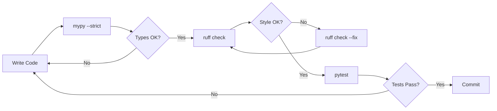

# Python Testing Tools: mypy, ruff, and pytest

**Audience:** Beginners learning Python testing and type safety
**Purpose:** Explain what these tools are, why we use them, and how they work together

---

## Overview

Modern Python projects use three complementary testing tools:

1. **mypy** - Static type checker (catches type errors before runtime)
2. **ruff** - Fast linter & formatter (enforces code style and quality)
3. **pytest** - Testing framework (runs unit and integration tests)

Think of them as three layers of defense:
- **mypy:** "Are the types correct?"
- **ruff:** "Is the code clean and styled correctly?"
- **pytest:** "Does the code actually work?"

---

## mypy: Static Type Checking

### What is mypy?

mypy is a **static type checker** for Python. It analyzes your code **without running it** to find type-related bugs.

**Analogy:** mypy is like a spell-checker for your code's types. Just like a spell-checker catches typos before you publish, mypy catches type errors before you run the code.

### Why Use mypy?

**Problem without types:**
```python
def calculate_profit(price, quantity):
    return price * quantity

# This runs without error... until it doesn't
profit = calculate_profit("100", 5)  # Returns "100100100100100" (oops!)
```

**Solution with type annotations:**
```python
def calculate_profit(price: float, quantity: int) -> float:
    return price * quantity

# mypy catches this BEFORE runtime
profit = calculate_profit("100", 5)  # Error: Expected float, got str
```

### Type Annotation Basics

```python
# Simple types
name: str = "AAPL"
price: float = 150.25
quantity: int = 100
is_tradable: bool = True

# Collections
symbols: list[str] = ["AAPL", "MSFT", "GOOGL"]
prices: dict[str, float] = {"AAPL": 150.25, "MSFT": 380.50}

# Optional (can be None)
stop_price: float | None = None  # Python 3.10+
# OR
from typing import Optional
stop_price: Optional[float] = None  # Python 3.9

# Function annotations
def fetch_quote(symbol: str) -> dict[str, float]:
    return {"bid": 150.00, "ask": 150.10}
```

### mypy Strictness Levels

```bash
# Basic (lenient)
mypy app.py

# Strict (what we use)
mypy app.py --strict
```

**What --strict enables:**
- Requires type annotations on all functions
- No implicit `Any` types
- Strict None checking (`Optional` required)
- No untyped function calls
- No untyped decorators

**Example:**
```python
# This passes basic mypy
def process_order(order):  # No type annotation
    return order.quantity * order.price

# This is required for --strict
def process_order(order: Order) -> Decimal:
    return order.quantity * order.price
```

### Common mypy Errors and Fixes

#### Error: `Missing type parameters for generic type`
```python
# ❌ Error
def get_prices() -> dict:
    return {"AAPL": 150.25}

# ✅ Fixed
def get_prices() -> dict[str, float]:
    return {"AAPL": 150.25}
```

#### Error: `Function is missing a return type annotation`
```python
# ❌ Error
async def health_check():
    return {"status": "healthy"}

# ✅ Fixed
async def health_check() -> dict[str, str]:
    return {"status": "healthy"}
```

#### Error: `Item "None" of "X | None" has no attribute`
```python
# ❌ Error
def get_version(registry):
    return registry.current_metadata.version  # metadata could be None

# ✅ Fixed - Option 1: Explicit check
def get_version(registry):
    if registry.current_metadata is None:
        raise ValueError("Metadata not loaded")
    return registry.current_metadata.version

# ✅ Fixed - Option 2: Conditional expression
def get_version(registry):
    return registry.current_metadata.version if registry.current_metadata else "unknown"
```

### When to Use `type: ignore`

`type: ignore` tells mypy to skip type checking for that line. Use sparingly!

**Acceptable uses:**
```python
# 1. Third-party library without type stubs
from sklearn.metrics import mean_squared_error  # type: ignore[import-untyped]

# 2. Known library typing limitations
df["returns"] = -df["close"].pct_change()  # type: ignore[operator]

# 3. Intentional type violation in tests
test_invalid_input(None)  # type: ignore[arg-type]
```

**❌ Unacceptable (code smell):**
```python
# Bad: Hiding real type errors
order = client.submit_order(request)
return order.id  # type: ignore[union-attr]  # Should use isinstance() instead
```

---

## ruff: Linting and Formatting

### What is ruff?

ruff is an **extremely fast** Python linter and formatter written in Rust. It combines the functionality of multiple tools:
- **flake8** (linting)
- **isort** (import sorting)
- **black** (formatting)
- **pylint** (code quality)
- **pyupgrade** (Python version upgrades)

**Speed:** 10-100x faster than traditional tools!

### Why Use ruff?

**Catches common bugs:**
```python
# ❌ ruff detects
def calculate_pnl(positions):
    for position in positions:
        pass  # B007: Loop variable never used
    return total  # F821: Undefined name 'total'
```

**Enforces code style:**
```python
# ❌ Bad import order
import sys
import numpy as np
import os

# ✅ ruff auto-fixes
import os
import sys

import numpy as np
```

### Common ruff Checks

#### F401: Unused imports
```python
# ❌ Error
from typing import Dict, List, Any  # Dict and List unused

# ✅ Fixed
from typing import Any
```

#### B904: Exception chaining
```python
# ❌ Bad
try:
    risky_operation()
except Exception as e:
    raise ValueError("Failed")  # Lost original exception

# ✅ Good
try:
    risky_operation()
except Exception as e:
    raise ValueError("Failed") from e  # Preserves stack trace
```

#### UP035: Deprecated typing imports
```python
# ❌ Old style (Python <3.9)
from typing import Dict, List
def process(data: Dict[str, List[int]]) -> None:
    ...

# ✅ Modern style (Python 3.9+)
def process(data: dict[str, list[int]]) -> None:
    ...
```

#### I001: Import sorting
```python
# ❌ Unsorted
import sys
from typing import Any
import os
from decimal import Decimal

# ✅ ruff auto-fixes (isort compatible)
import os
import sys
from decimal import Decimal
from typing import Any
```

### Running ruff

```bash
# Check for issues
ruff check .

# Auto-fix safe issues
ruff check . --fix

# Format code (like black)
ruff format .

# Check specific file
ruff check apps/signal_service/main.py
```

### Configuration

```toml
# pyproject.toml
[tool.ruff]
line-length = 100
target-version = "py311"

[tool.ruff.lint]
select = [
    "E",  # pycodestyle errors
    "F",  # pyflakes
    "I",  # isort
    "B",  # flake8-bugbear
    "UP", # pyupgrade
]
ignore = [
    "E501",  # Line too long (handled by formatter)
]
```

---

## pytest: Unit and Integration Testing

### What is pytest?

pytest is Python's most popular testing framework. It makes writing and running tests simple and powerful.

**Analogy:** If mypy checks that your recipe is written correctly, pytest actually cooks the dish to see if it tastes good.

### Why Use pytest?

**Tests catch bugs that types can't:**
```python
def calculate_stop_loss(entry_price: float, risk_percent: float) -> float:
    """Calculate stop loss price."""
    return entry_price * (1 + risk_percent)  # BUG: Should be subtraction!

# mypy says types are correct ✓
# pytest catches the logic error:
def test_calculate_stop_loss():
    stop = calculate_stop_loss(100.0, 0.02)  # 2% risk
    assert stop == 98.0  # FAILS: got 102.0 instead!
```

### Basic Test Structure

```python
# test_order_sizing.py

def test_position_size_calculation():
    """Test basic position sizing logic."""
    # Arrange (setup)
    capital = Decimal("100000")
    price = Decimal("150.25")
    weight = 0.10  # 10% allocation

    # Act (execute)
    shares = calculate_position_size(capital, price, weight)

    # Assert (verify)
    assert shares == 66  # floor(10000 / 150.25) = 66
```

### pytest Features

#### 1. Fixtures (setup/teardown)
```python
import pytest

@pytest.fixture
def redis_client():
    """Provide Redis client for tests."""
    client = RedisClient(host="localhost", port=6379)
    yield client  # Test runs here
    client.close()  # Cleanup after test

def test_circuit_breaker(redis_client):
    breaker = CircuitBreaker(redis_client)
    assert breaker.get_state() == CircuitBreakerState.OPEN
```

#### 2. Parametrize (multiple test cases)
```python
@pytest.mark.parametrize("price,qty,expected", [
    (100.0, 10, 1000.0),  # Normal case
    (150.5, 5, 752.5),    # Decimal price
    (200.0, 0, 0.0),      # Zero quantity
])
def test_calculate_notional(price, qty, expected):
    assert calculate_notional(price, qty) == expected
```

#### 3. Mocking (fake dependencies)
```python
from unittest.mock import Mock, patch

def test_order_submission():
    # Create mock Alpaca client
    mock_client = Mock()
    mock_client.submit_order.return_value = Mock(
        id="order123",
        status="accepted"
    )

    # Test with mock
    executor = AlpacaExecutor(client=mock_client)
    result = executor.submit_order(order_request)

    assert result["id"] == "order123"
    mock_client.submit_order.assert_called_once()
```

#### 4. Async tests
```python
@pytest.mark.asyncio
async def test_signal_generation():
    """Test async signal generation."""
    client = SignalServiceClient("http://localhost:8001")
    response = await client.fetch_signals(["AAPL", "MSFT"])
    assert len(response.signals) == 2
```

### Test Organization

```
tests/
├── unit/                  # Fast, isolated tests
│   ├── test_features.py
│   ├── test_position_sizing.py
│   └── test_circuit_breaker.py
├── integration/           # Tests with real dependencies
│   ├── test_signal_service.py
│   └── test_order_execution.py
└── e2e/                   # End-to-end tests
    └── test_full_workflow.py
```

### Running pytest

```bash
# Run all tests
pytest

# Run specific test file
pytest tests/test_breaker.py

# Run specific test
pytest tests/test_breaker.py::test_trip_and_reset

# Run with coverage
pytest --cov=apps --cov=libs

# Run only fast tests
pytest -m "not slow"

# Verbose output
pytest -v
```

### Test Markers

```python
import pytest

@pytest.mark.slow
def test_backtest():
    """Long-running backtest."""
    ...

@pytest.mark.integration
def test_database_query():
    """Requires database."""
    ...

# Run: pytest -m "not slow"  # Skip slow tests
```

---

## How the Tools Work Together

### Development Workflow



### Example: Full Check

```bash
# 1. Type check
mypy apps/ libs/ --strict
# → Checks: Types are correct

# 2. Lint and format
ruff check apps/ libs/ --fix
ruff format apps/ libs/
# → Checks: Code style, imports, common bugs

# 3. Test
pytest tests/ --cov=apps --cov=libs
# → Checks: Code actually works

# 4. All passed? Commit!
git commit -m "feat: add stop loss calculation"
```

### CI/CD Integration

```yaml
# .github/workflows/ci.yml
name: CI

on: [push, pull_request]

jobs:
  test:
    runs-on: ubuntu-latest
    steps:
      - uses: actions/checkout@v3

      - name: Install dependencies
        run: pip install -r requirements.txt

      - name: Type check
        run: mypy apps/ libs/ --strict

      - name: Lint
        run: ruff check apps/ libs/

      - name: Test
        run: pytest tests/ --cov=apps --cov=libs

      - name: Coverage
        run: coverage report --fail-under=80
```

---

## Real-World Example

Let's see all three tools in action:

### Original Code (Has Issues)
```python
def process_order(order):
    if order.qty > 0:
        price = get_current_price(order.symbol)
        return order.qty * price
```

### Issues Found

**mypy:**
```
error: Function is missing a return type annotation
error: Missing type parameters for generic type
error: Incompatible return value type (got "int | float", expected "Decimal")
```

**ruff:**
```
B006: Do not use mutable data structures for argument defaults
UP035: `typing.Dict` is deprecated, use `dict` instead
```

**pytest:**
```
FAILED test_process_order - AssertionError: expected Decimal('1502.50'), got 1502.5
```

### Fixed Code
```python
from decimal import Decimal

def process_order(order: Order) -> Decimal:
    """
    Calculate order notional value.

    Args:
        order: Order with symbol, quantity, and side

    Returns:
        Notional value in USD as Decimal

    Raises:
        ValueError: If quantity is invalid

    Example:
        >>> order = Order(symbol="AAPL", qty=10, side="buy")
        >>> process_order(order)
        Decimal('1502.50')
    """
    if order.qty <= 0:
        raise ValueError(f"Invalid quantity: {order.qty}")

    price = get_current_price(order.symbol)
    return Decimal(str(order.qty)) * price


# Test
def test_process_order():
    """Test order processing calculates correct notional."""
    order = Order(symbol="AAPL", qty=10, side="buy")
    with patch("app.get_current_price") as mock_price:
        mock_price.return_value = Decimal("150.25")
        result = process_order(order)
        assert result == Decimal("1502.50")
```

**Results:**
- ✅ mypy: All types annotated, return type matches
- ✅ ruff: Clean code style, modern typing
- ✅ pytest: Logic tested, edge cases covered

---

## Best Practices

### 1. Type Annotations
```python
# ✅ Good
def calculate_returns(
    prices: dict[str, Decimal],
    weights: dict[str, float]
) -> Decimal:
    ...

# ❌ Bad
def calculate_returns(prices, weights):
    ...
```

### 2. Explicit Runtime Checks
```python
# ✅ Good (production code)
if model is None:
    raise HTTPException(status_code=503, detail="Model not loaded")

# ❌ Bad (can be disabled with python -O)
assert model is not None, "model should be loaded"
```

### 3. isinstance() for Union Types
```python
# ✅ Good
response = api_client.get_order(order_id)
if not isinstance(response, Order):
    raise ValueError(f"Unexpected response type: {type(response)}")
return response.status

# ❌ Bad
response = api_client.get_order(order_id)
return response.status  # type: ignore[union-attr]
```

### 4. Comprehensive Tests
```python
# ✅ Good - Tests edge cases
@pytest.mark.parametrize("qty,expected", [
    (10, Decimal("1502.50")),    # Normal case
    (1, Decimal("150.25")),      # Minimum
    (0, ValueError),             # Zero (error)
    (-5, ValueError),            # Negative (error)
])
def test_process_order_edge_cases(qty, expected):
    ...
```

---

## Common Pitfalls

### 1. Over-using type: ignore
```python
# ❌ Bad - Hiding real issues
result = api.call()  # type: ignore
value = result.data  # type: ignore

# ✅ Good - Fix the root cause
result: APIResponse = api.call()
value: str = result.data
```

### 2. Not Testing Type Narrowing
```python
# ❌ Bad - isinstance() check not tested
if isinstance(order, Order):
    process_order(order)

# ✅ Good - Test both branches
def test_process_order_with_order():
    """Test with Order instance."""
    ...

def test_process_order_with_dict():
    """Test with dict raises error."""
    with pytest.raises(ValueError):
        process_order({"symbol": "AAPL"})
```

### 3. Ignoring ruff Fixes
```python
# ❌ Bad - Manual fixes
import sys
import os
from typing import Dict

# ✅ Good - Use ruff check --fix
import os
import sys
from typing import dict  # Auto-fixed by ruff
```

---

## Performance Considerations

### mypy
- **Speed:** ~2-10 seconds for medium project (incremental mode much faster)
- **Overhead:** None at runtime (static analysis only)
- **When to run:** Before commit, in CI/CD

### ruff
- **Speed:** <1 second for most projects (10-100x faster than alternatives)
- **Overhead:** None at runtime (linting only)
- **When to run:** On save (IDE integration), before commit, in CI/CD

### pytest
- **Speed:** Depends on test suite size
  - Unit tests: milliseconds each
  - Integration tests: seconds each
  - E2E tests: minutes each
- **Overhead:** Test execution time only
- **When to run:** Frequently during development, always in CI/CD

**Optimization:**
```bash
# Fast feedback (unit tests only)
pytest tests/unit/ -x  # Stop on first failure

# Full validation (all tests)
pytest tests/

# Parallel execution (faster)
pytest -n auto  # Uses all CPU cores
```

---

## Configuration Files

### pyproject.toml (modern Python projects)
```toml
[tool.mypy]
python_version = "3.11"
strict = true
warn_return_any = true
warn_unused_configs = true
disallow_untyped_defs = true

[tool.ruff]
line-length = 100
target-version = "py311"

[tool.ruff.lint]
select = ["E", "F", "I", "B", "UP"]

[tool.pytest.ini_options]
testpaths = ["tests"]
python_files = ["test_*.py"]
python_functions = ["test_*"]
addopts = "--strict-markers --cov=apps --cov=libs"
```

---

## Summary

### Quick Reference

| Tool | Purpose | When to Use | Speed |
|------|---------|-------------|-------|
| **mypy** | Type checking | Before commit | Fast (2-10s) |
| **ruff** | Linting & formatting | On save, before commit | Very fast (<1s) |
| **pytest** | Testing | Frequently, always in CI | Varies |

### The Golden Rule
```
Types + Style + Tests = Reliable Code
```

1. **mypy** ensures types are correct (prevents AttributeError, TypeError)
2. **ruff** ensures code is clean (prevents bugs, enforces style)
3. **pytest** ensures code works (prevents logic errors)

**All three are essential for production-quality Python code.**

---

## Further Reading

### Official Documentation
- [mypy documentation](https://mypy.readthedocs.io/)
- [ruff documentation](https://docs.astral.sh/ruff/)
- [pytest documentation](https://docs.pytest.org/)

### Related Concepts
- Type narrowing and guards
- Generic types and protocols
- Test-driven development (TDD)
- Continuous integration (CI/CD)

### Project-Specific
- `/docs/LESSONS_LEARNED/mypy-strict-migration.md` - Our migration story
- `/docs/STANDARDS/CODING_STANDARDS.md` - Project coding standards
- `/docs/STANDARDS/TESTING.md` - Testing requirements
