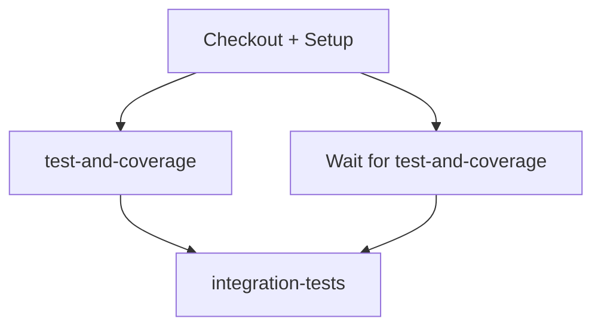

# CI/CD Pipeline Guide

**Last Updated:** 2026-01-14
**Status:** Active
**Owner:** Development Team

---

## Overview

This document describes the CI/CD pipeline for the trading platform, including workflow architecture, selective test execution, performance characteristics, and debugging strategies.

**Key Principles:**
- **Selective execution:** Only run workflows when relevant files change
- **Parallel jobs:** Run independent test suites concurrently
- **Safety first:** Multiple validation gates prevent accidental live trading
- **Fast feedback:** Local CI mirrors remote CI for faster iteration

---

## CI/CD Architecture

### Workflow Categories

| Workflow | Trigger | Purpose | Duration |
|----------|---------|---------|----------|
| **ci-tests-coverage.yml** | PR, push to master | Core test suite + coverage | ~15-20min |
| **backtest-regression.yml** | Selective paths | Validate backtest parity | ~5-10min |
| **docker-build.yml** | PR, push to master | Build + push Docker images | ~8-12min |
| **deploy-staging.yml** | Push to master | Deploy to staging environment | ~6-8min |
| **markdown-link-check.yml** | Weekly + markdown changes | Validate documentation links | ~2-3min |
| **pr-auto-review-request.yml** | PR open/sync | Auto-request AI code reviews | <30sec |
| **repomix-context.yml** | PR | Generate AI review context | ~3-5min |

**Total CI time (all workflows):** ~35-50 minutes per PR

---

## Workflow Details

### 1. ci-tests-coverage.yml (Main Test Suite)

**Trigger:**
```yaml
on:
  push:
    branches: [master, main]
  pull_request:
    branches: [master, main]
```

**Jobs:**
1. **test-and-coverage** (runs first)
   - Python 3.11 on Ubuntu
   - Install dependencies via Poetry
   - Validate with mypy, ruff
   - Run unit/component tests: `pytest -m "not integration and not e2e"`
   - Enforce 50% coverage (will raise to 80%)
   - Upload coverage to Codecov
   - Comment coverage on PR (skipped if >15k lines changed)

2. **integration-tests** (depends on test-and-coverage)
   - Start infrastructure: Postgres, Redis
   - Run integration tests: `pytest -m integration`
   - Service health checks via custom action
   - Cleanup Docker resources

**Optimization features:**
- **Parallel jobs:** Unit tests + integration tests run concurrently after basic validation
- **Selective test markers:** `@pytest.mark.integration`, `@pytest.mark.e2e` for granular control
- **Docker disk management:** Prunes images before building to prevent disk space issues
- **Buildx caching:** GitHub Actions cache speeds up Docker builds
- **Service health checks:** Wait-for-services action validates infrastructure readiness

**Coverage threshold:**
```yaml
fail_under: 50  # TODO: Raise to 80% after backfilling tests
```

**Performance:**
- Unit tests: ~8-10min
- Integration tests: ~5-7min
- Total: ~15-20min (parallel execution)

---

### 2. backtest-regression.yml (Backtest Parity Validation)

**Trigger (selective paths):**
```yaml
paths:
  - 'strategies/alpha_baseline/**'
  - 'libs/backtest/**'
  - 'libs/data/**'
  - 'artifacts/backtests/golden_manifest.json'
```

**Purpose:** Ensure research backtest results match production signal generation

**Key features:**
- **Golden manifest staleness check:** Fails if >90 days old (forces periodic refresh)
- **Checksum validation:** Ensures golden manifest integrity before running tests
- **Selective triggering:** Only runs when backtest-related code changes

**Safety mechanism:**
```yaml
# Fail if golden manifest is stale (>90 days)
LAST_UPDATED=$(jq -r '.last_updated' artifacts/backtests/golden_manifest.json)
DAYS_OLD=$(( ($(date +%s) - $(date -d "$LAST_UPDATED" +%s)) / 86400 ))
if [ $DAYS_OLD -gt 90 ]; then
  echo "::error::Golden manifest is stale ($DAYS_OLD days old)"
  exit 1
fi
```

---

### 3. docker-build.yml (Container Image Builds)

**Trigger (selective paths):**
```yaml
paths:
  - 'apps/**'
  - 'libs/**'
  - 'strategies/**'
  - 'pyproject.toml'
  - 'poetry.lock'
  - 'apps/*/Dockerfile'
```

**Matrix strategy:**
```yaml
matrix:
  service:
    - name: signal_service
      port: 8001
    - name: execution_gateway
      port: 8002
    - name: orchestrator
      port: 8003
```

**Image tags:**
- `sha-<short-commit>` (all events)
- `<branch-name>` (branch pushes)
- `pr-<number>` (PRs)
- `latest` (master/main only)

**Optimization features:**
- **Parallel builds:** All 3 services build concurrently via matrix
- **Buildx caching:** `cache-from: type=gha` + `cache-to: type=gha,mode=max`
- **Push control:** `push: ${{ github.event_name != 'pull_request' }}` (build-only for PRs)
- **Multi-stage Dockerfiles:** Builder stage + runtime stage for smaller images

**Registry:** GitHub Container Registry (ghcr.io)

**Performance:**
- First build: ~8-12min (cold cache)
- Cached build: ~3-5min (warm cache)

---

### 4. deploy-staging.yml (Staging Deployment)

**Trigger:**
```yaml
on:
  push:
    branches: [master, main]
  workflow_dispatch:
```

**Safety gates:**
1. **Credential validation job** (runs first):
   - Verify `ALPACA_PAPER_API_KEY` exists
   - Verify `ALPACA_PAPER_API_SECRET` exists
   - **Block live API keys:** Fail if `ALPACA_LIVE_API_KEY` found in staging
   - Verify `DRY_RUN=true` flag

2. **Deployment job** (depends on validation):
   - Pull latest Docker images
   - Stop existing services
   - Start services with paper trading credentials
   - Wait for health checks (max 120 seconds)
   - Run smoke tests:
     - Health endpoints: `/health` for all services
     - Paper trading verification: Check `dry_run=true` and `alpaca_paper=true`

**Environment variables:**
```yaml
ALPACA_API_KEY_ID: ${{ secrets.ALPACA_PAPER_API_KEY }}  # Paper only
ALPACA_API_SECRET_KEY: ${{ secrets.ALPACA_PAPER_API_SECRET }}
ALPACA_PAPER: "true"
DRY_RUN: "true"
ENVIRONMENT: "staging"
```

**Critical safety check:**
```yaml
# Block live API keys (safety check)
if [ -n "${{ secrets.ALPACA_LIVE_API_KEY }}" ]; then
  echo "::error::ALPACA_LIVE_API_KEY found in staging environment"
  echo "::error::Staging environment must ONLY have paper trading credentials"
  exit 1
fi
```

**Performance:** ~6-8 minutes (image pull + health checks + smoke tests)

---

### 5. markdown-link-check.yml (Documentation Validation)

**Trigger (multi-mode):**
```yaml
on:
  push:
    paths: ['**.md']
  pull_request:
    paths: ['**.md']
  schedule:
    - cron: '0 9 * * 1'  # Weekly on Mondays
  workflow_dispatch:
```

**Exclusions:**
- `.venv/` (virtual environment)
- `docs/ARCHIVE/` (historical docs with stale links)
- `CLAUDE.md` and `AGENTS.md` (root symlinks)

**Configuration:** `.github/markdown-link-check-config.json`

**Performance:** ~2-3 minutes

**Purpose:**
- Prevent broken cross-references in documentation
- Catch moved/renamed workflow files
- Validate external URLs

---

### 6. pr-auto-review-request.yml (Automated Review Requests)

**Trigger:**
```yaml
on:
  pull_request:
    types: [opened, reopened, ready_for_review, synchronize]
```

**Purpose:** Auto-request reviews from `@gemini-code-assist` when PRs are opened

**Authentication:** Uses `USER_PR_TOKEN` (Personal Access Token) to comment as user instead of github-actions[bot]

**Review request template:**
```markdown
🤖 **Automated Review Request**

@gemini-code-assist please review this pull request and check for:
- Code quality issues
- Potential bugs or security vulnerabilities
- Test coverage gaps
- Documentation completeness
- Compliance with project standards
```

**Performance:** <30 seconds

---

### 7. repomix-context.yml (AI Review Context)

**Trigger:**
```yaml
on:
  pull_request:
    branches: [master, main]
  workflow_dispatch:
```

**Purpose:** Generate AI-optimized codebase context for code reviews

**Outputs:**
1. **repomix-full.xml:** Complete codebase (compressed, Tree-sitter)
2. **repomix-changed.xml:** Only changed files in PR

**Security filtering:**
- Exclude binary files: `*.png`, `*.jpg`, `*.pdf`, etc.
- Exclude credentials: `.env`, `*.pem`, `*.key`, `credentials.json`, `secrets.json`
- Secret scanning: Grep for `API_KEY|SECRET_KEY|PASSWORD|AUTH_TOKEN` patterns
- Fail if secrets detected

**Retention:** 7 days (artifacts)

**Performance:** ~3-5 minutes

**Ignore pattern validation:**
```yaml
# Ensure repomix.config.json and workflow are in sync
CONFIG_PATTERNS=$(jq -r '.ignore.customPatterns | sort | join(",")' repomix.config.json)
if [ "$WORKFLOW_SORTED" != "$CONFIG_SORTED" ]; then
  echo "::warning::Ignore patterns may be out of sync"
fi
```

---

## Selective Test Execution

### Pytest Markers

**Available markers:**
```python
@pytest.mark.integration  # Integration tests (requires infrastructure)
@pytest.mark.e2e         # End-to-end tests (full workflow)
@pytest.mark.slow        # Slow tests (>5 seconds)
```

**CI execution patterns:**
```bash
# Unit tests only (fast, no infrastructure)
pytest -m "not integration and not e2e"

# Integration tests only (requires Redis + Postgres)
pytest -m integration

# E2E tests only (full workflow)
pytest -m e2e

# All tests
pytest
```

**Local execution:**
```bash
# Run what CI runs (unit tests only)
pytest -m "not integration and not e2e"

# Run everything (mirrors CI fully)
make ci-local
```

---

## Parallel Job Strategies

### ci-tests-coverage.yml Parallel Jobs



**Dependency:** `integration-tests` depends on `test-and-coverage` to avoid wasted runs if unit tests fail

### docker-build.yml Matrix Parallelism

```yaml
matrix:
  service: [signal_service, execution_gateway, orchestrator]
```

**Result:** All 3 services build concurrently (3x speedup)

---

## Caching Strategies

### 1. Poetry Dependency Cache
```yaml
- name: Cache Poetry dependencies
  uses: actions/cache@v4
  with:
    path: ~/.cache/pypoetry
    key: ${{ runner.os }}-poetry-${{ hashFiles('**/poetry.lock') }}
```

**Savings:** ~2-3 minutes per run (avoids re-downloading packages)

### 2. Docker Buildx Cache
```yaml
- name: Build and push Docker image
  uses: docker/build-push-action@v5
  with:
    cache-from: type=gha
    cache-to: type=gha,mode=max
```

**Savings:** ~5-8 minutes per build (layer caching)

### 3. Pytest Cache
```yaml
- name: Run tests
  run: pytest --cache-clear  # Clear to avoid stale state
```

**Note:** Cache cleared in CI for reproducibility

---

## Performance Metrics

### Current Benchmarks (as of 2026-01-14)

| Metric | Value | Target |
|--------|-------|--------|
| **Total CI time** | 35-50min | <30min |
| **Unit tests** | 8-10min | <5min |
| **Integration tests** | 5-7min | <4min |
| **Docker builds** | 8-12min (cold) | <6min |
| **Coverage upload** | 1-2min | <1min |
| **Service startup** | 2-3min | <2min |

### Bottlenecks Identified

1. **Poetry install:** ~3-4min (can be cached better)
2. **Mypy validation:** ~2-3min (can run in parallel)
3. **Docker layer builds:** ~5-8min (multi-stage builds help)
4. **Service health checks:** ~1-2min (waiting for Postgres/Redis)

---

## Optimization Opportunities

### 1. Split Test Suite by Domain
**Current:** All unit tests run sequentially
**Proposed:** Parallel test jobs by domain:
```yaml
matrix:
  domain: [libs, apps, strategies, integration]
```

**Savings:** ~40% reduction (12min → 7min)

### 2. Cache Mypy Results
**Current:** Mypy runs from scratch every time
**Proposed:** Cache `.mypy_cache/` directory
```yaml
- name: Cache mypy
  uses: actions/cache@v4
  with:
    path: .mypy_cache
    key: ${{ runner.os }}-mypy-${{ hashFiles('**/*.py') }}
```

**Savings:** ~1-2 minutes

### 3. Pre-build Docker Base Image
**Current:** Each service builds Python 3.11 slim + dependencies
**Proposed:** Publish `trading-platform-base:latest` with common dependencies
```dockerfile
FROM ghcr.io/yourorg/trading-platform-base:latest
COPY apps/signal_service/ ./apps/signal_service/
```

**Savings:** ~3-5 minutes per build

### 4. Use `pytest-xdist` for Parallel Tests
**Current:** Tests run sequentially in single process
**Proposed:** Run tests in parallel:
```bash
pytest -n auto  # Auto-detect CPU count
```

**Savings:** ~30-40% reduction (10min → 6min)

**Risk:** Shared state issues (requires investigation)

---

## Local CI Execution

### Quick Command
```bash
make ci-local
```

**What it does:**
1. Validates environment matches `pyproject.toml`
2. Runs mypy type checking
3. Runs ruff linting
4. Runs full test suite (including integration tests)
5. Enforces coverage threshold
6. Runs workflow gates validation

**Performance:** ~15-20 minutes (same as remote CI)

**Benefits:**
- **2-4x faster feedback** than waiting for GitHub Actions
- **No GitHub Actions minutes consumed**
- **Identical to remote CI** (same checks, same thresholds)

### Debugging CI Failures Locally

**Scenario 1: Tests fail in CI but pass locally**
```bash
# Ensure Poetry environment matches lock file
poetry install --sync

# Clear all caches
make clean
rm -rf .pytest_cache .mypy_cache .ruff_cache

# Re-run CI
make ci-local
```

**Scenario 2: Mypy fails in CI but passes locally**
```bash
# Check Python version
python --version  # Should be 3.11.x

# Ensure strict mode
mypy --strict libs/ apps/ strategies/
```

**Scenario 3: Integration tests fail in CI but pass locally**
```bash
# Check infrastructure is running
make status

# Check service health
curl http://localhost:8001/health  # signal_service
curl http://localhost:8002/health  # execution_gateway
curl http://localhost:8003/health  # orchestrator

# Check database connectivity
docker exec -it trading-postgres psql -U trader -d trading_db -c "SELECT 1"

# Check Redis connectivity
docker exec -it trading-redis redis-cli ping
```

---

## Debugging Failed CI Runs

### 1. Check GitHub Actions Logs

**Navigate to:**
1. Repository → Actions tab
2. Select failed workflow run
3. Click failed job
4. Expand failed step

**Common failures:**
- **Poetry install timeout:** Network issue (retry workflow)
- **Docker disk space:** Prune job failed (will retry automatically)
- **Service health check timeout:** Infrastructure startup issue (retry)

### 2. Download Artifacts

**Available artifacts:**
- `pytest-results`: Test output
- `coverage-report`: HTML coverage report
- `repomix-full-context`: Full codebase context (for debugging)
- `repomix-changed-context`: Changed files only

**Download:**
```bash
gh run download <run-id> --name pytest-results
```

### 3. Reproduce Locally

**Strategy:**
```bash
# 1. Check out the same commit
git checkout <commit-sha>

# 2. Ensure clean environment
make clean
poetry install --sync

# 3. Run the same command CI ran
# (Copy from GitHub Actions logs)
pytest -m "not integration and not e2e" --cov=libs --cov=apps --cov=strategies

# 4. Check for environment differences
echo $PYTHONPATH  # Should include project root
which python3     # Should be .venv/bin/python3
```

### 4. Common Issues and Fixes

| Error | Cause | Fix |
|-------|-------|-----|
| `ModuleNotFoundError: No module named 'libs'` | PYTHONPATH not set | `export PYTHONPATH=$PWD:$PYTHONPATH` |
| `poetry: command not found` | Poetry not installed | `pip install poetry` |
| `E: Unable to locate package` | Apt cache stale | `sudo apt-get update` |
| `FAILED ... Connection refused` | Service not running | `make up` (start infrastructure) |
| `Coverage failure: 45% < 50%` | Coverage too low | Add tests or reduce threshold |

---

## CI/CD Best Practices

### 1. Always Run Local CI Before Pushing
```bash
# Required before every commit
make ci-local
```

**Why:** Catches 90% of CI failures before push (saves time + GitHub Actions minutes)

### 2. Use Selective Triggers
```yaml
on:
  push:
    paths:
      - 'apps/**'
      - 'libs/**'
```

**Why:** Avoid wasted CI runs when only docs change

### 3. Pin Action Versions
```yaml
# ✅ Good (pinned to commit SHA)
uses: actions/checkout@8ade135a41bc03ea155e62e844d188df1ea18608

# ❌ Bad (unpinned, subject to supply-chain attacks)
uses: actions/checkout@v4
```

**Why:** Supply-chain security (prevents compromised action updates)

### 4. Use GitHub Environments for Secrets
```yaml
environment: staging  # Enforces protection rules
```

**Why:**
- **Isolation:** Staging secrets separate from production
- **Protection rules:** Require approval for deployment
- **Audit trail:** Who deployed what, when

### 5. Fail Fast
```yaml
strategy:
  fail-fast: true  # Stop all jobs if one fails
```

**Why:** Save GitHub Actions minutes (don't run integration tests if unit tests fail)

---

## Security Considerations

### 1. Secret Scanning
**Workflows with secret detection:**
- `repomix-context.yml`: Scans output for `API_KEY|SECRET_KEY|PASSWORD|AUTH_TOKEN`
- `deploy-staging.yml`: Blocks live API keys in staging environment

**Pattern:**
```bash
if grep -qE '(API_KEY|SECRET_KEY)["\x27]?\s*[:=]\s*["\x27][A-Za-z0-9+/]{20,}' file.xml; then
  echo "::error::Potential secret detected"
  exit 1
fi
```

### 2. Credential Isolation
**Environments:**
- **staging:** Paper trading credentials only (validated)
- **production:** Live trading credentials (manual deployment only)

**Validation:**
```yaml
# Block live API keys in staging
if [ -n "${{ secrets.ALPACA_LIVE_API_KEY }}" ]; then
  echo "::error::Live API keys not allowed in staging"
  exit 1
fi
```

### 3. Permissions Principle of Least Privilege
```yaml
permissions:
  contents: read        # Read-only access to code
  packages: write       # Write access to container registry (docker-build only)
  pull-requests: write  # Write access to PRs (auto-review only)
```

### 4. Supply-Chain Security
**Pinned actions:**
```yaml
# All actions pinned to commit SHA (not version tag)
uses: actions/checkout@8ade135a41bc03ea155e62e844d188df1ea18608
```

**Poetry lock file:** Committed to ensure reproducible builds

---

## Workflow Gates

### Pre-Commit Gates (Enforced by `workflow_gate.py`)
- ✅ Reviews approved (Codex + Gemini)
- ✅ Local CI passed (`make ci-local`)
- ✅ Component in `implement` phase
- ✅ No `--no-verify` bypass

**See:** `docs/AI/Workflows/01-git.md` for complete workflow

### Pre-Merge Gates (GitHub Branch Protection)
- ✅ CI tests pass
- ✅ Coverage threshold met (50%)
- ✅ No merge conflicts
- ✅ Approving review from maintainer

### Pre-Deploy Gates (Staging)
- ✅ Credential validation (paper trading only)
- ✅ Health checks pass
- ✅ Smoke tests pass (DRY_RUN=true verified)

---

## Monitoring and Alerts

### GitHub Actions Status Badge
```markdown
[](https://github.com/yourorg/trading-platform/actions)
```

### Notification Channels
**Current:** GitHub Actions UI only

**TODO:**
- [ ] Slack notifications for deployment failures
- [ ] Email notifications for critical CI failures
- [ ] PagerDuty integration for production deployment failures

### Metrics to Track
- **CI success rate:** % of green builds
- **Mean time to feedback:** Commit → CI result
- **GitHub Actions minutes consumed:** Monthly usage
- **Flaky test rate:** Tests that fail intermittently

---

## Future Improvements

### 1. Self-Hosted Runners
**Current:** GitHub-hosted runners (ubuntu-latest)
**Proposed:** Self-hosted runners on AWS/GCP

**Benefits:**
- **Faster builds:** No cold start, persistent caches
- **Cost savings:** ~50% reduction for high-volume usage
- **Custom hardware:** GPU for model training tests

**Risks:**
- **Security:** Need to isolate untrusted PRs
- **Maintenance:** Runner setup, updates, monitoring

### 2. Test Result Caching
**Current:** All tests run every time
**Proposed:** Cache test results keyed by file hashes

**Approach:**
```bash
# Only run tests for changed files
pytest --lf --ff  # Last failed first, then fresh
```

**Savings:** ~30-50% reduction for small changes

### 3. Dependency Graph Analysis
**Current:** All workflows run on every push
**Proposed:** Analyze dependency graph to skip unaffected workflows

**Example:**
- Change only `docs/` → Skip `docker-build.yml`
- Change only `apps/signal_service/` → Skip execution_gateway build

**Tool:** `dorny/paths-filter` GitHub Action

### 4. Progressive Test Execution
**Current:** All tests run in parallel
**Proposed:** Run fast tests first, slow tests only if fast tests pass

**Approach:**
```yaml
jobs:
  fast-tests:
    run: pytest -m "not slow"
  slow-tests:
    needs: fast-tests
    run: pytest -m slow
```

**Savings:** Fail fast (don't run slow tests if fast tests fail)

---

## Related Documents

- [TESTING.md](../STANDARDS/TESTING.md) - Test strategy and standards
- [GIT_WORKFLOW.md](../STANDARDS/GIT_WORKFLOW.md) - Git branching and PR workflow
- [PYTHON_DEPENDENCIES.md](../STANDARDS/PYTHON_DEPENDENCIES.md) - Dependency management
- [Workflows/01-git.md](../AI/Workflows/01-git.md) - AI agent git workflow

---

## Appendix: Workflow File Locations

```
.github/
├── workflows/
│   ├── ci-tests-coverage.yml          # Main test suite
│   ├── backtest-regression.yml        # Backtest parity validation
│   ├── docker-build.yml               # Container image builds
│   ├── deploy-staging.yml             # Staging deployment
│   ├── markdown-link-check.yml        # Documentation validation
│   ├── pr-auto-review-request.yml     # Automated review requests
│   └── repomix-context.yml            # AI review context generation
├── actions/
│   └── wait-for-services/             # Custom action for service health checks
└── markdown-link-check-config.json    # Link checker configuration
```

---

**Last Updated:** 2026-01-14
**Author:** Claude Code
**Status:** Active - Update when CI/CD architecture changes
