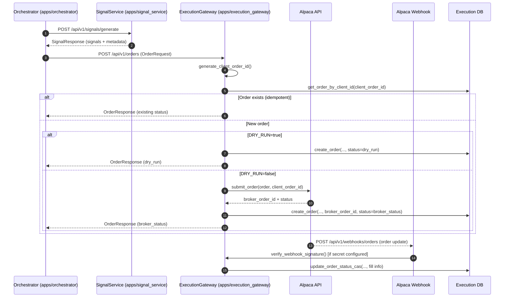
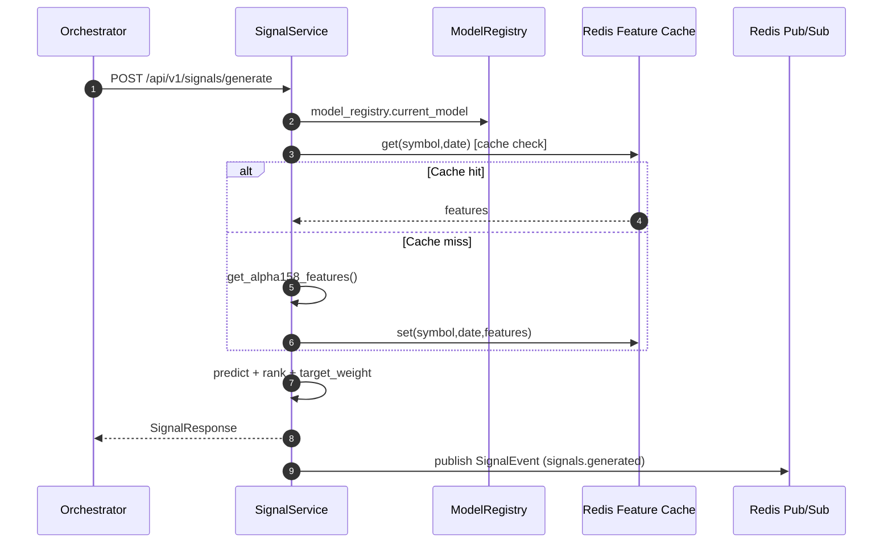
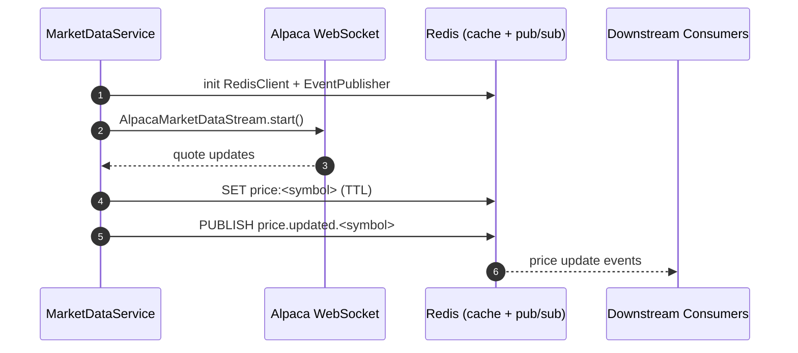
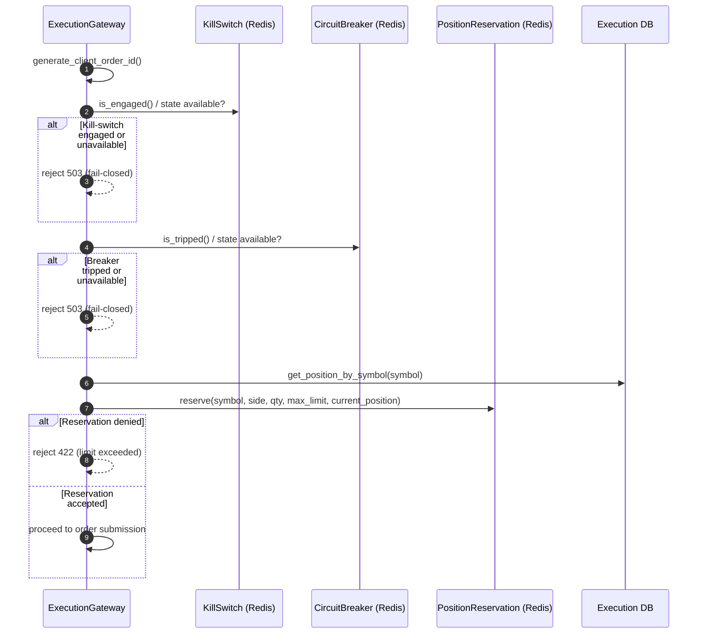
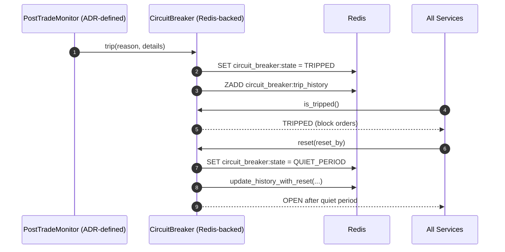
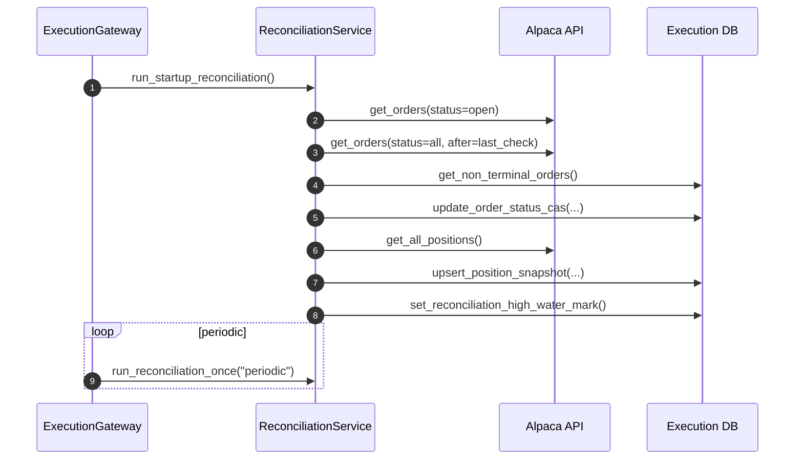

# System Mechanisms (Critical Business Processes)

This document captures the **six critical business processes** as implemented in the codebase, with step-by-step technical walkthroughs and Mermaid sequence diagrams. It is intended to be operationally precise and tied to actual code paths.

> Note: Some components (e.g., PostTradeMonitor) are described in ADRs but are not currently present as concrete services in `apps/`. Those are explicitly labeled as **ADR-defined / planned** where applicable.

---

## 1) Order Execution Lifecycle

**Scope:** Orchestrator → Signal Service → Execution Gateway → Alpaca API → Webhook → DB state update

### Mermaid Sequence Diagram

### Step-by-step (Implementation-accurate)

1. **Signal fetch**: Orchestrator calls Signal Service at `POST /api/v1/signals/generate` using `SignalServiceClient.fetch_signals()`.
   - Code: `apps/orchestrator/clients.py` (`fetch_signals`), `apps/signal_service/main.py` (`generate_signals`).
2. **Order mapping**: Orchestrator maps signals to order requests and submits them via `ExecutionGatewayClient.submit_order()`.
   - Code: `apps/orchestrator/orchestrator.py` (`_map_signals_to_orders`, `_submit_orders`).
3. **Idempotent order ID**: Execution Gateway generates a deterministic `client_order_id` via `generate_client_order_id()`.
   - Code: `apps/execution_gateway/order_id_generator.py` (SHA256 hash of order params + UTC date).
4. **Fail-closed safety gates**: Execution Gateway blocks if kill-switch/circuit-breaker/position reservation are unavailable or tripped.
   - Code: `apps/execution_gateway/main.py` (`submit_order` checks).
5. **Idempotency check**: Execution Gateway queries DB for existing `client_order_id` and returns it if found.
   - Code: `apps/execution_gateway/main.py` (`db_client.get_order_by_client_id`).
6. **DRY_RUN path**: Execution Gateway creates the DB record with `status=dry_run` and returns immediately.
   - Code: `apps/execution_gateway/main.py` (`db_client.create_order`).
7. **LIVE path** (when `DRY_RUN=false`): Execution Gateway submits to Alpaca with `client_order_id`, then creates the DB record using the broker order id/status from the response. Webhook/reconciliation updates status later.
   - Code: `apps/execution_gateway/alpaca_client.py` (`submit_order`), `apps/execution_gateway/main.py` (`db_client.create_order`).
8. **Webhook updates**: Alpaca posts to `POST /api/v1/webhooks/orders`. Execution Gateway verifies signature **only when `ALPACA_WEBHOOK_SECRET` is configured** (dev/test allows unsigned) and updates order/fill state via CAS.
   - Code: `apps/execution_gateway/main.py` (`order_webhook`), `apps/execution_gateway/webhook_security.py`.
9. **State reconciliation (continuous)**: Reconciliation service can correct status mismatches (see Process #6).

### Related Specs / ADRs

- [`ADR-0006`](../ADRs/0006-orchestrator-service.md)
- [`ADR-0014`](../ADRs/0014-execution-gateway-architecture.md)
- [`ADR-0015`](../ADRs/0015-twap-order-slicer.md)
- [`orchestrator.md`](./services/orchestrator.md)
- [`execution_gateway.md`](./services/execution_gateway.md)
- [`execution_gateway.json`](./openapi/execution_gateway.json)

---

## 2) Signal Generation Pipeline

**Scope:** Model registry → Feature computation/cache → Signal generation → Redis publish

### Mermaid Sequence Diagram

### Step-by-step (Implementation-accurate)

1. **Request entry**: Signal generation starts at `POST /api/v1/signals/generate`.
   - Code: `apps/signal_service/main.py` (`generate_signals`).
2. **Model selection**: Signal Service uses `ModelRegistry` to access the active model + metadata.
   - Code: `apps/signal_service/model_registry.py`.
3. **Feature parity compute**: Features are computed via research-shared code (`strategies/alpha_baseline/features.py`).
   - Code: `apps/signal_service/signal_generator.py` (`get_alpha158_features`).
4. **Feature cache**: Redis-backed `FeatureCache` is checked and updated per symbol/date.
   - Code: `libs/redis_client/feature_cache.py` (get/set/mget), `apps/signal_service/signal_generator.py`.
5. **Predictions + weights**: The model predicts returns, then target weights are computed (top-N / bottom-N).
   - Code: `apps/signal_service/signal_generator.py` (`generate_signals`).
6. **Publish event**: Signal Service emits `SignalEvent` to Redis pub/sub channel `signals.generated`.
   - Code: `libs/redis_client/event_publisher.py`, `apps/signal_service/main.py` (`_publish_signal_event_with_fallback`).

### Related Specs / ADRs

- `docs/ADRs/0004-signal-service-architecture.md`
- `docs/ADRs/0009-redis-integration.md`
- `docs/ADRs/0022-qlib-integration.md`
- `docs/SPECS/services/signal_service.md`
- `docs/SPECS/services/model_registry.md`
- `docs/CONCEPTS/feature-parity.md`

---

## 3) Data Ingestion Pipeline

**Scope:** Alpaca WebSocket → MarketDataService → Redis (cache + pub/sub) → Consumers

### Mermaid Sequence Diagram

### Step-by-step (Implementation-accurate)

1. **Service start**: MarketDataService creates `RedisClient` + `EventPublisher`, then starts `AlpacaMarketDataStream`.
   - Code: `apps/market_data_service/main.py` (`lifespan`).
2. **Subscription management**: `PositionBasedSubscription` periodically pulls positions from Execution Gateway to auto-subscribe symbols.
   - Code: `apps/market_data_service/position_sync.py` (`_sync_subscriptions`).
3. **WebSocket stream**: Alpaca `StockDataStream` delivers quote updates to `_handle_quote()`.
   - Code: `libs/market_data/alpaca_stream.py` (`_handle_quote`).
4. **Redis cache**: Quote mid-price is stored as `price:<symbol>` with TTL.
   - Code: `libs/market_data/alpaca_stream.py` (uses `RedisKeys.price`).
5. **Pub/Sub event**: Price updates are published to `price.updated.<symbol>`.
   - Code: `libs/market_data/alpaca_stream.py` (`EventPublisher.publish`).
6. **Consumers**: Downstream services subscribe to Redis channels as needed (no concrete consumer implementations in `apps/` today).

### Related Specs / ADRs

- `docs/ADRs/0010-realtime-market-data.md`
- `docs/ADRs/0009-redis-integration.md`
- `docs/SPECS/services/market_data_service.md`

---

## 4) Risk Check Flow (Pre-trade)

**Scope:** Execution Gateway pre-trade validation with fail-closed safety guards

### Mermaid Sequence Diagram

### Step-by-step (Implementation-accurate)

1. **ID generation**: `client_order_id` computed for idempotent submission.
   - Code: `apps/execution_gateway/order_id_generator.py`.
2. **Kill-switch check**: Fail-closed if kill-switch is engaged or Redis state is unavailable.
   - Code: `apps/execution_gateway/main.py` (`submit_order`).
3. **Circuit breaker check**: Fail-closed if breaker tripped or state missing.
   - Code: `apps/execution_gateway/main.py` (`submit_order`).
4. **Reconciliation gating**: Order blocked if reconciliation gate not open or symbol quarantined.
   - Code: `apps/execution_gateway/main.py` (`_require_reconciliation_ready_or_reduce_only`, `_check_quarantine`).
5. **Position reservation**: Atomic reserve in Redis to prevent race conditions on position limits.
   - Code: `libs/risk_management/position_reservation.py`, invoked in `apps/execution_gateway/main.py`.
6. **Fat-finger checks**: Size thresholds enforce warning/reject paths before broker submission.
   - Code: `apps/execution_gateway/main.py` (`fat_finger_validator`).

> Note: `libs/risk_management/checker.py` implements a general `RiskChecker` (breaker, **blacklist**, position limits, **notional exposure**) but is **not currently wired into Execution Gateway's order submission flow**. As a result, blacklist and notional-limit checks are **not enforced** in the live pre-trade path today.

### Related Specs / ADRs

- `docs/ADRs/0011-risk-management-system.md`
- `docs/SPECS/libs/risk_management.md`
- `docs/SPECS/services/execution_gateway.md`
- `docs/CONCEPTS/risk-management.md`

---

## 5) Circuit Breaker Activation

**Scope:** Trip conditions, state transitions, recovery gating

### Mermaid Sequence Diagram

### Step-by-step (Implementation-accurate + ADR-defined monitor)

1. **Trip conditions**: ADR defines post-trade triggers (drawdown, daily loss, data staleness, broker errors).
   - Reference: `docs/ADRs/0011-risk-management-system.md`.
2. **Breaker state machine**: `CircuitBreaker` persists state in Redis (`circuit_breaker:state`) and writes trip history.
   - Code: `libs/risk_management/breaker.py`.
3. **Service enforcement**: Execution Gateway checks breaker on every order submit (fail-closed when unavailable).
   - Code: `apps/execution_gateway/main.py` (`submit_order`).
4. **Reset flow**: Web console and service layer invoke `CircuitBreaker.reset()`; state moves to QUIET_PERIOD, then OPEN.
   - Code: `apps/web_console/services/cb_service.py`, `libs/risk_management/breaker.py`.

> **PostTradeMonitor status**: A dedicated monitor service is described in ADRs but not present as a runnable app in `apps/`. The breaker can still be tripped manually via web console or other callers to `CircuitBreaker.trip()`.

### Related Specs / ADRs

- `docs/ADRs/0011-risk-management-system.md`
- `docs/SPECS/libs/risk_management.md`
- `docs/SPECS/services/web_console.md`
- `docs/RUNBOOKS/circuit-breaker-ops.md`

---

## 6) Reconciliation / Position Sync

**Scope:** Boot-time + periodic reconciliation between broker state and DB

### Mermaid Sequence Diagram

### Step-by-step (Implementation-accurate)

1. **Startup gate**: Execution Gateway invokes `run_startup_reconciliation()` before opening the startup gate.
   - Code: `apps/execution_gateway/reconciliation.py` (`run_startup_reconciliation`).
2. **Order pull**: Reconciler pulls open orders and recent orders from Alpaca with overlap window.
   - Code: `apps/execution_gateway/reconciliation.py` (`_run_reconciliation`).
3. **DB diff + CAS updates**: Broker state is applied via `update_order_status_cas(...)`, with source priority tie-breakers.
   - Code: `apps/execution_gateway/reconciliation.py` (`SOURCE_PRIORITY_RECONCILIATION`), `apps/execution_gateway/database.py`.
4. **Orphan detection**: Broker orders not present in DB are quarantined or marked for investigation.
   - Code: `apps/execution_gateway/reconciliation.py` (`_handle_orphan_order`).
5. **Position sync**: Reconciler pulls broker positions and upserts snapshots into DB.
   - Code: `apps/execution_gateway/reconciliation.py` (`_reconcile_positions`).
6. **High-water mark**: Updates reconciliation high-water timestamp and metrics for observability.
   - Code: `apps/execution_gateway/reconciliation.py` (`set_reconciliation_high_water_mark`).
7. **Manual controls**: Operators can trigger reconciliation via `POST /api/v1/reconciliation/run` or force-complete.
   - Code: `apps/execution_gateway/main.py`.

### Related Specs / ADRs

- `docs/ADRs/0020-reconciliation-service-architecture.md`
- `docs/SPECS/services/execution_gateway.md`
- `docs/RUNBOOKS/ops.md`

---

## References (Source Files)

- `apps/orchestrator/orchestrator.py`
- `apps/orchestrator/clients.py`
- `apps/signal_service/main.py`
- `apps/signal_service/signal_generator.py`
- `apps/signal_service/model_registry.py`
- `apps/execution_gateway/main.py`
- `apps/execution_gateway/order_id_generator.py`
- `apps/execution_gateway/webhook_security.py`
- `apps/execution_gateway/reconciliation.py`
- `apps/execution_gateway/database.py`
- `apps/market_data_service/main.py`
- `apps/market_data_service/position_sync.py`
- `libs/market_data/alpaca_stream.py`
- `libs/redis_client/event_publisher.py`
- `libs/redis_client/feature_cache.py`
- `libs/risk_management/breaker.py`
- `libs/risk_management/position_reservation.py`
